<div align="center">


# EcoLedger

**Track. Earn. Sustain.**

A campus rewards platform for real environmental work. Students log eco-actions with photo proof,
an admin verifies them, and every approval mints **Campus Carbon Tokens (CCT)**, an ERC-20 token,
to the student's wallet on Ethereum.


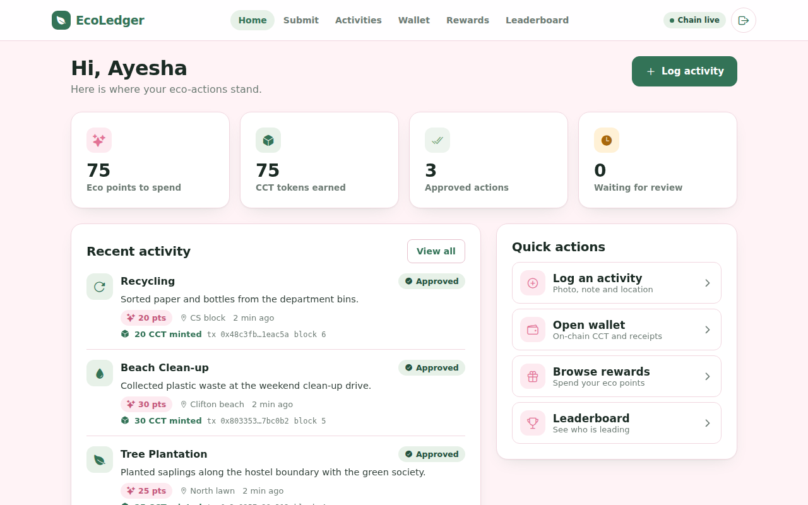

</div>

## Why

Campus sustainability drives usually run on sign-up sheets and trust. Points get lost, nobody can
check who did what, and there is little reason to keep going. EcoLedger makes each verified action
count: a person reviews it, the student earns points to spend on campus perks, and the reward is
recorded as a token mint on a public blockchain that nobody can quietly edit afterwards.

## Features

**Students**
- Sign up and get a wallet address automatically, or connect their own (e.g. MetaMask)
- Log an activity with type, description, location and a proof photo
- Follow each activity from *pending* to *approved* or *rejected* (with the reason)
- Wallet with the live on-chain CCT balance and a receipt (transaction hash and block) for every mint
- Spend eco points on rewards; minted CCT stays in the wallet
- Leaderboard ranked by tokens earned
- Works offline: an activity submitted without a connection is saved on the device and sent later

**Admins**
- Review queue with proof photos, filters and counts
- Approve to credit points and mint tokens in one step, or reject with a reason
- If the chain is unavailable, approval still counts and the mint can be retried later

**Under the hood**
- Points are decided by the server from the activity type, never by the app
- Password hashing (bcrypt), JWT sessions and admin-only routes
- An activity can only be approved once, even if two admins click at the same time
- Every mint emits `EcoReward(student, amount, activityId)`, linking the token to its database record
- One codebase for web, Android and iOS, laid out for phone, tablet and desktop

## How it works

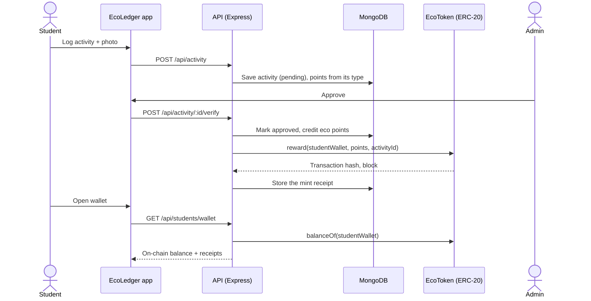

## Screenshots

| Sign in | Log an activity |
| --- | --- |
| 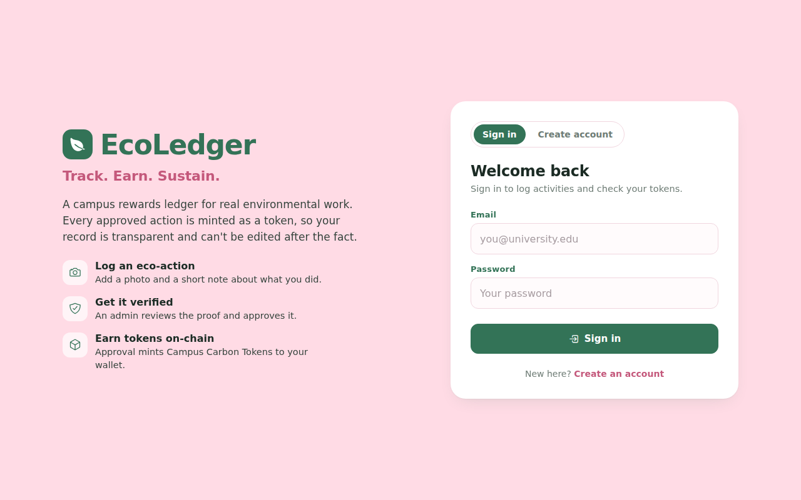 | 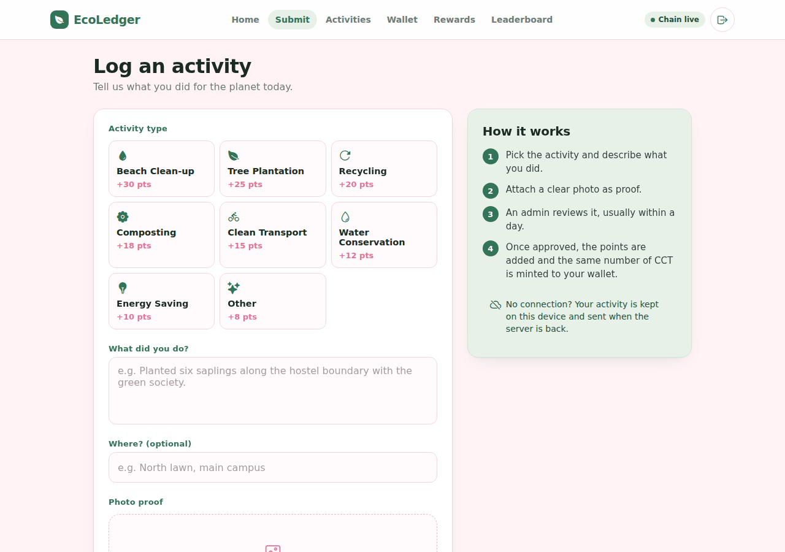 |
| **Wallet** | **Admin review** |
| 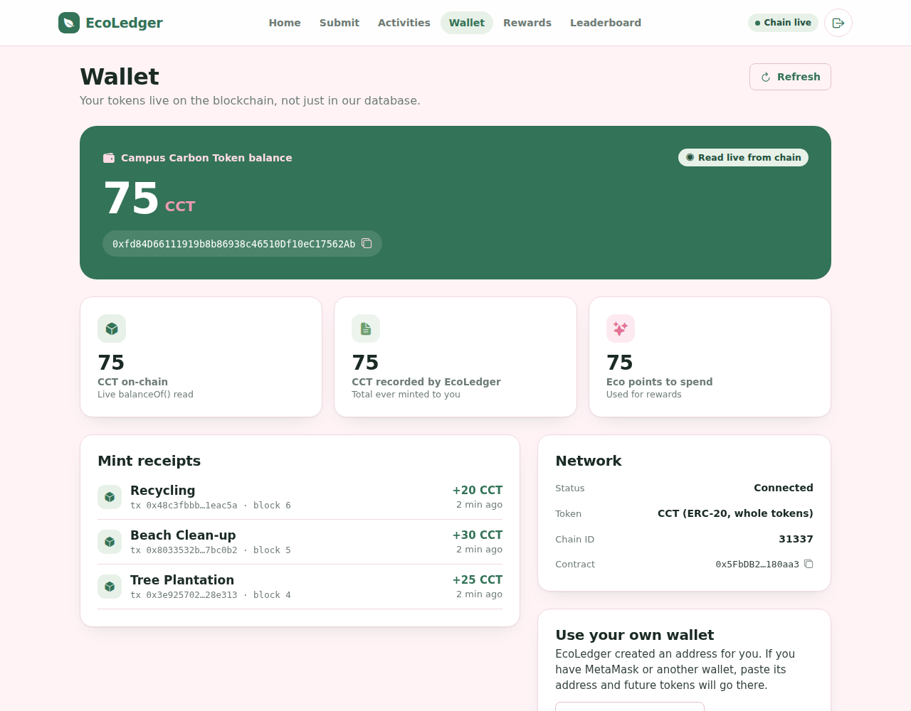 | 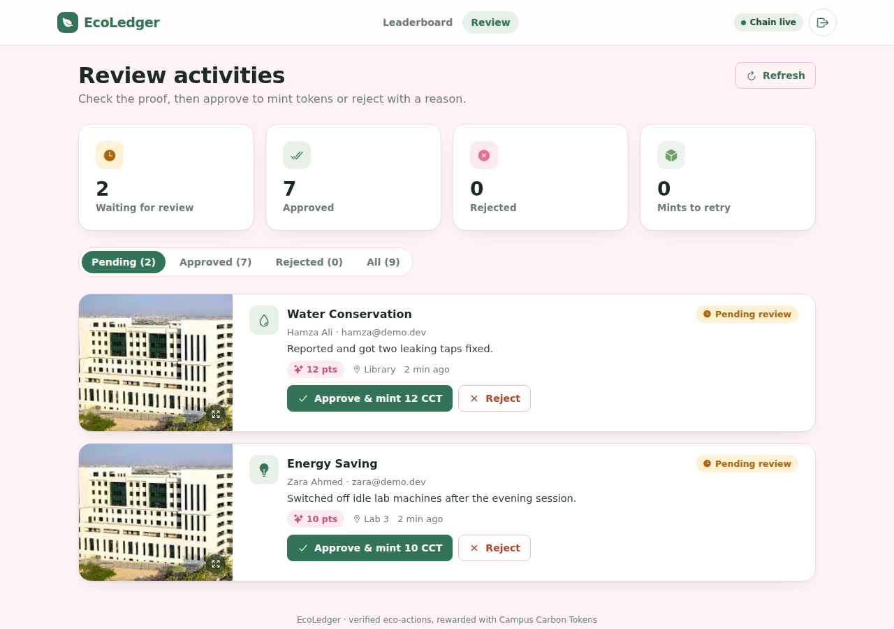 |
| **Rewards** | **Leaderboard** |
| 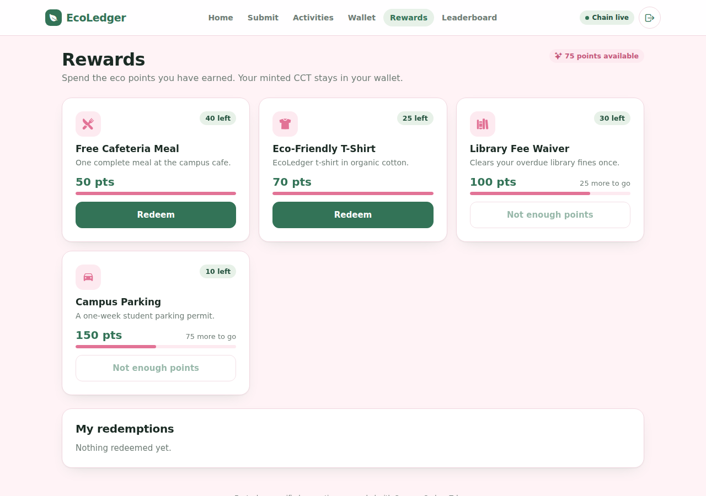 | 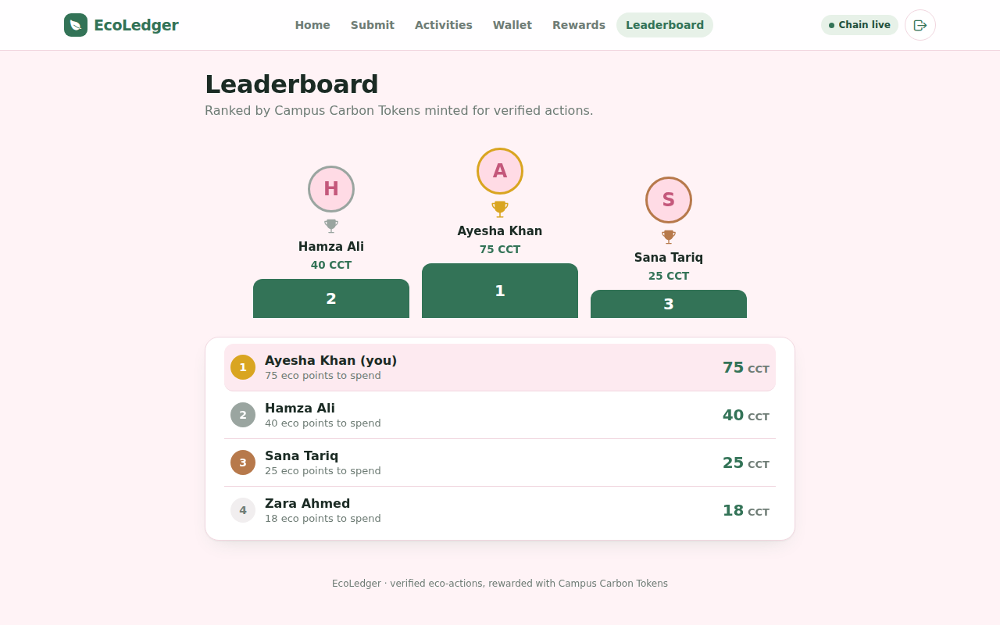 |

<p align="center">
  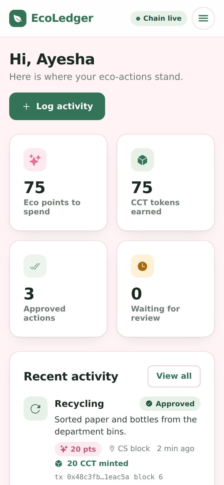
  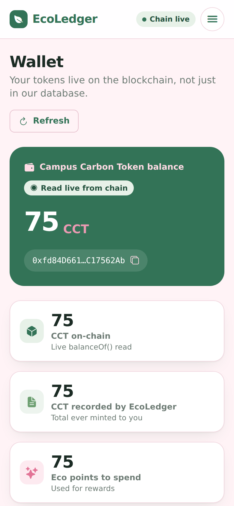
  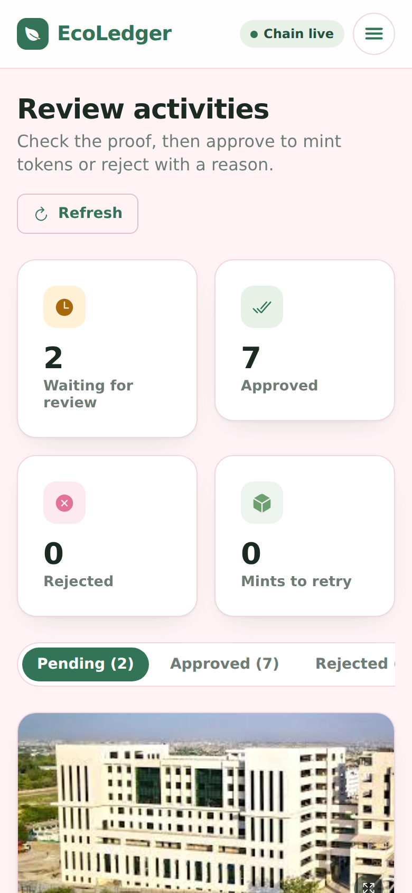
</p>

## Tech stack

| Layer | Technology |
| --- | --- |
| App | Expo 54, React Native, React Native Web, Expo Router, TypeScript |
| API | Node.js 20, Express 5, Mongoose 9, JWT, bcrypt, Multer |
| Database | MongoDB (local or MongoDB Atlas); proof photos are stored in MongoDB too |
| Blockchain | Solidity 0.8.20, OpenZeppelin ERC-20 + Ownable, Hardhat, ethers v6 |
| Hosting | Vercel (app), Render (API), MongoDB Atlas (database), Sepolia testnet (token) |
| CI | GitHub Actions: contract tests, type check, lint and web build |

## Project structure

```
ecoledger/
├── backend/                  API and smart contract
│   ├── contracts/            EcoToken.sol (CCT)
│   ├── test/                 Contract tests (Hardhat, Mocha, Chai)
│   ├── scripts/              deploy.js, smoke-test.js
│   ├── config/               Database, blockchain service, seed data
│   ├── models/               Student, Activity, ActivityType, Reward, Redemption, Proof
│   ├── routes/               REST endpoints
│   ├── middleware/           Auth and photo upload
│   ├── deployments/          Public contract addresses (written by the deploy script)
│   └── server.js
├── frontend/                 Expo app (web, Android, iOS)
│   ├── app/                  Screens (file-based routing)
│   ├── components/           Shared UI kit and activity rows
│   ├── lib/                  API client, session, offline queue
│   └── constants/theme.ts    Colours, spacing, breakpoints
├── docs/
│   ├── DEPLOYMENT.md         Step-by-step guide to a live link
│   ├── design/               Colour palette and original screen mockups
│   ├── screenshots/
│   └── EcoLedger-proposal.docx
├── render.yaml               Render blueprint for the API
└── .github/workflows/ci.yml
```

## Run it locally

**You need:** Node.js 20+ and MongoDB on `127.0.0.1:27017`
(install [MongoDB Community](https://www.mongodb.com/try/download/community), or put a free
[MongoDB Atlas](https://www.mongodb.com/atlas) connection string in `backend/.env` as `MONGO_URI`).

```bash
# Terminal 1: local blockchain
cd backend
npm install
npm run chain

# Terminal 2: deploy the token, then start the API
cd backend
npm run deploy        # run again whenever you restart the chain
npm start             # http://localhost:5000

# Terminal 3: the app
cd frontend
npm install
npm run web           # opens http://localhost:8081
```

For a phone, run `npx expo start` in `frontend` and scan the QR code with Expo Go (same Wi-Fi as
the computer). The app finds the API by itself; set `EXPO_PUBLIC_API_URL` to point it elsewhere.

**Admin login (created on first start):** `admin@ecoledger.dev` / `admin123`.
Change it with `ADMIN_EMAIL` and `ADMIN_PASSWORD` in `backend/.env` (see `backend/.env.example`).

## Check that everything works

1. **Health check:** open http://localhost:5000/api/health. You should see `"database": true` and
   `"contract": true`. The app header shows **Chain live** when everything is connected.
2. **Contract tests:** `cd backend && npm test` runs 7 tests on the token (minting, ownership, events, transfers).
3. **End-to-end smoke test:** with the API running, `cd backend && npm run smoke`. It registers a test
   student, submits an activity with a photo, approves it as the admin and confirms the tokens arrived
   on-chain. To test a deployed API: `npm run smoke -- https://your-api.onrender.com`.
4. **By hand:** create a student account, log an activity, sign in as the admin, approve it, then open
   the student's Wallet. The balance goes up and a mint receipt appears.

CI runs the contract tests, type check, lint and web build on every push.

## Deploy

The app deploys to **Vercel**, the API to **Render**, the database to **MongoDB Atlas** and the token to
the **Sepolia** test network, all on free plans. Follow [docs/DEPLOYMENT.md](docs/DEPLOYMENT.md).

## API

See [backend/README.md](backend/README.md) for the endpoint list and contract details.

## Author

**Minahil Nadeem** · [GitHub](https://github.com/minahilnadeem6688) · [LinkedIn](https://www.linkedin.com/in/minahil-nadeem23)
